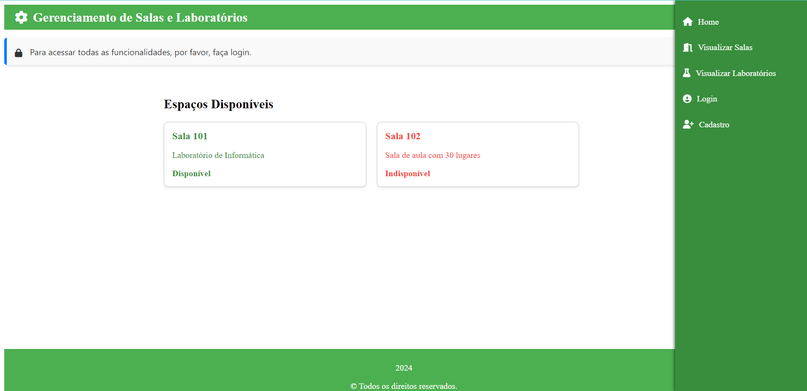
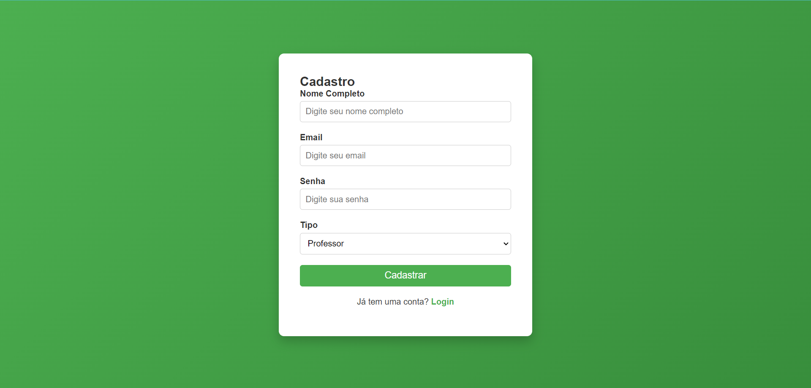

# Projeto Gerenciamento de Salas e Laboratórios

## Descrição
Este projeto é um sistema de gerenciamento de salas e laboratórios, desenvolvido utilizando HTML, CSS e JavaScript no front-end, com integração ao back-end em Spring Boot. O objetivo é proporcionar uma interface intuitiva para registro e login de usuários, além de visualização e gerenciamento de salas e laboratórios.

## Funcionalidades
- Registro de novos usuários
- Login de usuários existentes
- Visualização de salas e laboratórios

## Capturas de Tela

### Página Inicial (index.html)


### Página de Login (login.html)


### Página de Registro (register.html)


## Como Executar o Projeto

1. Clone o repositório:
   ```bash
   https://github.com/rma98/room-lab-manager-frontend.git

2. Navegue até o diretório do projeto:
   ```bash
   cd nome-do-repositorio

## Tecnologias Utilizadas

- HTML
- CSS
- JavaScript
- Spring Boot (Back-end)

## Contribuições

Sinta-se à vontade para contribuir com melhorias! Para isso, faça um fork do repositório e envie suas pull requests.

## Licença

Este projeto é licenciado sob a MIT License - veja o arquivo LICENSE para mais detalhes.
